上网这么多年，第一次见自己挂自己的脑残，实在佩服。

# 喜欢引流？广告位不请自来
你还在为RB自动循环不够精细而心生苦恼吗？
你还在为MINION精修轴太贵而囊中羞涩吗？
你还在为自动循环的LOGS太低而暗自愤慨吗？

使用AEAssist，给你最优质的面向高难自动循环体验！
自定义爆发，多条件处理让你logs99
可视化编程，让小白也可以飞速上手写轴
与多个卫月底裤插件兼容，拥有AE，就是拥有底裤！
心动不如心动，机不可失时不再来
不要998 不要98 也不要9.8
只要进群获取AE测试码，你就可以立刻体验爽滑的高难自动循环体验！

除此之外，AEAssist还拥有各项底裤功能
速度增加，显示身位，自动四人本，TP瞬移
提供代码贡献者更可以体验免控，攻击距离增加，技能不位移等私密功能！
现在还未正式发布，在测试期间提供贡献者更有神秘功能体验！
快来加入AEAssist2.0大家庭，一起为FF14的高难自动循环贡献力量！
[点击链接加入群聊【AEAssist 2.0】](http://qm.qq.com/cgi-bin/qm/qr?_wv=1027&k=EyT0BfZWCVq8v2yiMjSqcb4lEqYuaF_P&authKey=UJFoVZ3OljlBhSilXpeLKIIzofI4ZUjJfjuqCgr%2BiaT3Y6HmQFVbXZ5xBOlSv5yZ&noverify=0&group_code=552689154)

# 关于[ArchiDog1998（秋水）](https://github.com/ArchiDog1998)的[爹味小作文](https://archidog1998.github.io/RotationSolver/#/ChineseServer/)

关于 AA 的前世今生，具体移步[这里](https://github.com/ArchiDog1998/RotationSolver#%E5%AF%B9%E4%BA%8E%E5%9B%BD%E6%9C%8D%E7%94%A8%E6%88%B7)配合食用

## 到底在说谁呢

还真当自己是大领导了，没工资谁给你打工啊？你以为谁都跟你一样带薪写挂？
把你那国企带来的爹味收收，以为谁都跟你一样没有自己的生活啊 😅

我从你所谓的 AA 让 MC 接手之后天天忙的要死，群都没看过几次，真没空陪你发癫。这都能被你惦记上，你可真是喜欢热脸贴我冷屁股。

[您，Yukki Imai@Tonberry](https://jp.finalfantasyxiv.com/lodestone/character/38751017/)，满级职业都没几个，有空对着木桩玩你那半吊子循环、给部队长过生日，不如先把游戏玩明白了。山猪吃不了细糠，毕竟凭你 30 分水准的游戏理解，真的看不出什么是好东西，你可以天天抱着你那一坨灰色游戏理解，继续嘴上吊打全天下的外挂。

## 打脸记录

来看清楚这个人的真实嘴脸是怎么样的

### 剽窃其他作者努力成果

---

**在 RS2.2.5 版本后，秋某重新添加属于作者名的属性一栏，并将以前所有职业的循环归属于自己名下 😅😅😅**   
**请问你是如何在没做到全职业满级的情况下写出全职业循环的，你一定是天才吧 Yukki Imai@Tonberry** 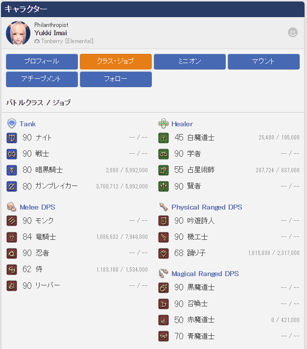截于 2023-4-12  
哦，你的号还是淘宝买的，有些满级职业还不是你自己打出来的呢

在 AA 开始有其他开发者加入编写循环后，秋某于**2022 年 11 月 9 日**提交了修改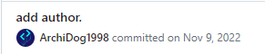  
第一次提到**循环的作者**这一概念并在插件中显示作者名称。以下是原始代码

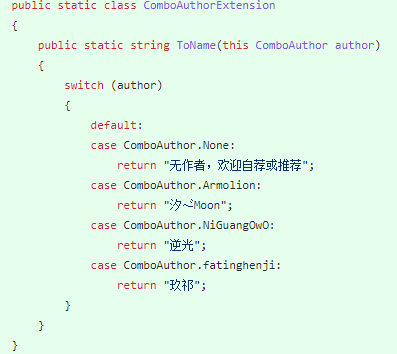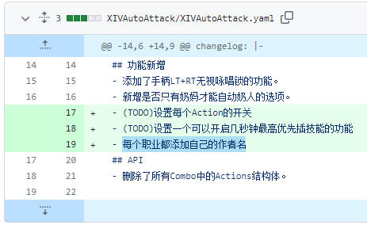

截止秋某声称停止维护的最后一个版本**0.11.0.3**,以下是所有职业的维护情况

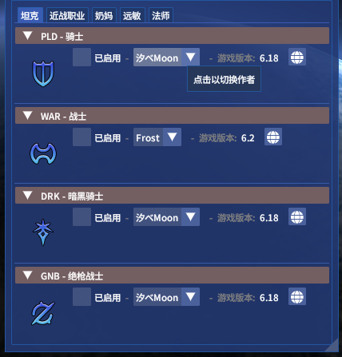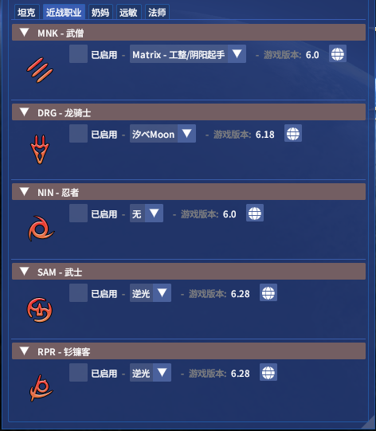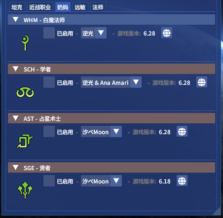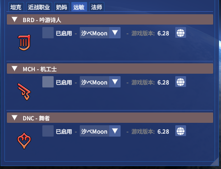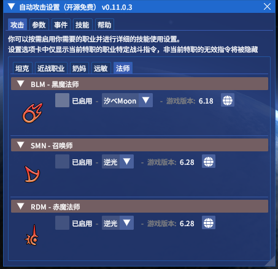

以上可以看出在停更前几乎全职业都有作者在维护循环，**不知你怎么有脸给各个作者扣上《自私且慵懒的同僚》帽子，就因为单方面宣布停更然后没人接盘吗 😅😅😅**

#### 以下是转折点

在秋某重新开始维护并将 AA 改名为 RotationSolver（以下简称 RS）后，在**2023 年 1 月 19 日**一次不起眼的[更新](https://github.com/ArchiDog1998/RotationSolver/commit/c770978fd50f87380b11129bddb86f25969013dc)中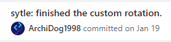将循环代码中**原本定义为作者名字（Author）的变量名更改为循环名字（RotationName），尝试抹去原来所有作者努力的痕迹**

并在后续的[提交](https://github.com/ArchiDog1998/RotationSolver/commit/c9dec3bc99b7518000f155d8453495c5d774b246)中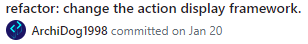将所有职业的作者名字修改为 default

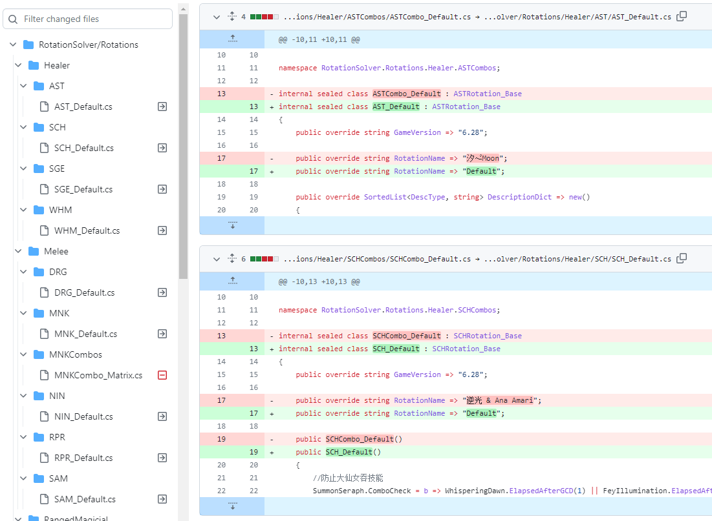

关于以上变动呢，秋某本人是怎么狡辩的呢，在这个[视频](https://www.bilibili.com/video/BV1624y1z7iv/)可以看到

省流原话如下：   
那么首先第一个哈，就是我没有把作者全部改成 default，为什么呢，因为这是我在新改的插件里面已经没有作者，这一栏用的是 rotation name，所以说它是循环名称啊

**在评论区的回答也是相当有意思的**

**问：** 00：32 此处提到已经没有作者这一栏，那么首先这个循环是非作者本人提供的，那么循环提供者要求表明作者名称的情况下为什么还要将其抹掉？就算循环提供者没有明确提出表明作者名称，将非作者本人提供的循环表明出处也是应该的吧。
插件你也说明是你自己的插件，那么你如果不表明非自己研发部分的作者名称，在使用者看来第一反应应该是作者本人所撰写的循环，但这循环很显然不是作者本人提供的，那是否有盗窃国服循环提供者的劳动成果来取悦国际服用户的意图？没有重构循环将其直接夺取我感觉其实也是是极致的懒惰。  
**答：** 首先，在开源社区中，声明循环时哪个作者写的并不是由我写的代码说了算的。之前所谓的 Author 是我自己加上去的，不具备任何实际意义。**（合着是二进制代码所以不具有劳动付出呗？😅）** 而开源社区的标明作者写了哪些部分，是根据 git 文件中的描述来定义的。而且标明作者这个想法是我提出来的，不是他们要求的。**（开源社区都会展示 Contributors 你难道不应该加吗？）** 其次，在此之前我已经提供了全套职业的循环，后来我是开放给大家改的。所以这些循环起码有一半以上是我写的。**（你要不要对比下 diff 看看跟你原来写的答辩还有任何关系吗）** 另外根据我的插件设计理念，循环的撰写并不是我的职责，而是各位合伙人的职责，这是他们的工作内容。

**问：** 所以为什么偷循环不加作者？不是全由你做的为什么不加？请正面回应  
**答：** git 文件里面有完整的作者列表，你也可以从代码的 Contributors 中查看到所有作者在什么时候改了什么，这个东西才是作者的定义，是有效力的。所以我没有删除作者信息，如果我删除了，你在 Github 上的 Contributors 就看不到作者的列表了。我只改了代码，改了项目的代码。**（请问作为一个普通插件用户，第一眼直观看到作者是谁不是从 UI 上，难道还要特意去翻 Github 上源代码看看都有谁 commit 了？？？）**

### ~~2.未完待更新~~
写小作文没意思，不写了。不像某些人，起一个功能介绍的视频标题，45分钟视频里30分钟在欣赏自己黑历史，还看得津津乐道。

## 那些年被天才秋皇踩过的其他插件
总之就是天才秋皇看不起其他一切插件，一切国服作者，觉得都没有自己的AA的“框架”优秀。如果有，那就只是因为还没有人来打白工贡献combo，而自己的框架是无法比拟的！
### Sloth Combo
说实话笔者是在Sloth Combo的群里知道有一个作者在维护AA这个插件的，当时听说这边的“氛围很好”，没想到埋下了Flag。
（太久远的已经很难翻到了。）
>“感觉就像你们当年给我推荐sc一样
>“aa是sc能比的吗？

### Artisan

- 对着技能提示高亮表示
>“这也太TMD丑了吧！”

然后抄了这部分代码缝进自己的AA

- 对着只有NQ的蛮族任务物品，发出如下评价

>“为什么他一下子给我做了个NQ！我脸黑了。”

对于Artisan的求解器逻辑发表如下评论

>“用了我不满意！”
>“写的太垃圾了。”
>“artisan好垃圾啊，搓出来10不存1的。”
>“求解器有啥用？”
>“求解器能预判状态？”
>“我反正只写高速制作”
>“老子高速制作！”
>“次次都拼手气！”
这里是秋皇认为高速制作是最上位的制作，所以学会了高速制作之后什么中级制作都可以拖出技能栏了。比起求解器，秋皇认为生产的最终思路是跟战斗一样，使用优先级Combo。由此可见他连最基础的生产逻辑都没有理解就开始指指点点了
- 于是秋皇开始了他的传销行为，没错，就是那套“我产出框架我的贡献占大头，你们来写Combo，写得好是我的框架优秀，写的不好就是你们冷漠贪婪自私慵懒”的强盗逻辑
>“要不我写个？”
>“我给个combo接口，就像写职业一样”
>“你自己写！”
>“你说的规划可以做到，只要你会写combo”
>“那么谁来写？”
- 还没个雏形就开始展望未来
>“太可怕了!aa自带制作哦 想想就可怕。”

### AEAssist
（待补充）（大概内容为AE是什么垃圾远远赶不上我的AA）

## 其他经典语录合集
### AA被ban都是因为你们擅自加了危险的内容

内部消息称，某獭爹banAA是因为看到秋皇在B站上一系列跳脚行为，感到十分震惊，怎么世界上还有这样的小丑？！

但是秋皇对此的评价是

>“国服的AA被Ban了，还删库了，潇洒！感谢獭爹神助攻”

### 青魔小试

自己开了很多坑，包括但不限于青魔和制作，但是突然撂挑子不干之后

>“轻松多了”
>“没人喊我研究青魔研究各种职业，或者研究高速制作了。”
>“也不用去看零式绝本了”
>“快乐！”

然后在这之后上传了天青斗场只用水炮白风和扔鱼（单反玩过青魔的都知道这是多么有含金量的打法），没获得时间奖章等等加分项的视频。

称只用了40行（就能做到“这种程度”），得出结论，

>“我的框架是很优秀的！”
